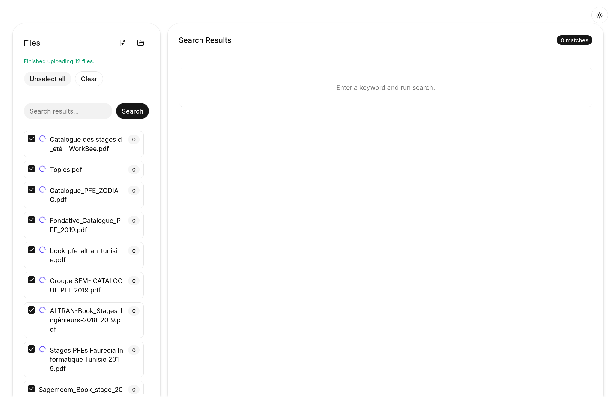
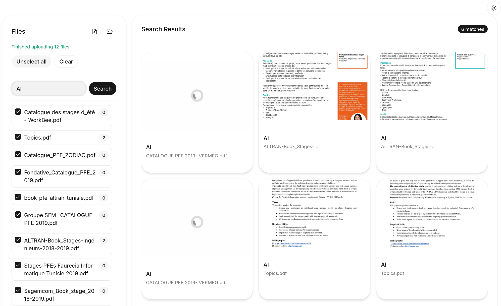
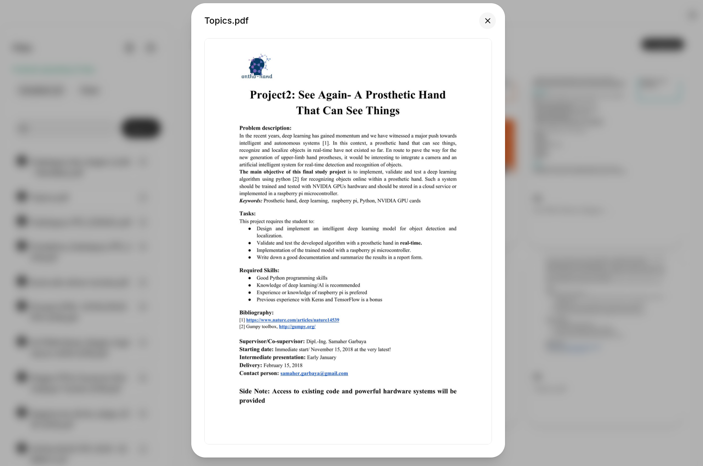

# pdf-fuzz — Search inside your PDFs, even when you don't know the exact words

Upload your PDF collection, type what you're looking for, and find the right document even when you misspelled it or only remember a fragment of the text.

## ✨ What it does

- **Drop your PDFs** into the web interface
- **Type what you remember** — e.g., "annual report revnue 2024" (typos welcome!)
- **It finds the right documents** and shows you where the text appears
- **Everything runs on your own machine** — your files never leave your computer

<p align="center">
  
  <br>
  <em>Upload your PDFs and search them in one place</em>
</p>

## 👤 Who it's for

Anyone with a collection of PDFs who needs to search them by content, not just filenames:

- **Researchers** searching through interview transcripts or academic papers
- **Accountants** looking for specific invoices or financial reports
- **Students** finding passages in lecture notes or textbooks
- **Writers** tracking citations across reference materials
- **Paralegals** searching document bundles for relevant clauses
- Basically anyone drowning in PDFs who needs to find things fast

## 🚀 Getting started

### What you'll need

**Docker** — a free tool that runs pdf-fuzz in a self-contained environment so you don't need to install any programming languages or libraries manually.

- [Download Docker for Mac](https://docs.docker.com/desktop/install/mac-install/)
- [Download Docker for Windows](https://docs.docker.com/desktop/install/windows-install/)
- [Download Docker for Linux](https://docs.docker.com/desktop/install/linux-install/)

### Run it

Open a terminal (Command Prompt on Windows, Terminal on Mac/Linux) and run:

```bash
git clone --recurse-submodules https://github.com/HazemBZ/pdf-fuzz
cd pdf-fuzz
docker compose up
```

Open **http://localhost:7000** in your browser and start uploading PDFs.

### Stop it

Press **Ctrl + C** in the terminal window where it's running, or run:

```bash
docker compose down
```

## 📖 How it works (in plain language)

1. **Upload** your PDFs through the web page
2. **Behind the scenes**, the system extracts the text from each PDF and stores it efficiently
3. **Search** using everyday words — it finds matches even with typos, partial words, or slightly different phrasing
4. **Results** show you which PDFs matched and highlight where the text appears

## Features

- **Fuzzy Text Search** — Search across PDF files with fuzzy matching (typos and partial words work)
- **File Management** — Upload, view, and delete PDF files
- **Processing States** — Track file processing (queued/processing/success/failure)
- **File Deduplication** — Automatically detect and handle duplicate files
- **Dark/Light Mode** — Toggle between themes
- **Docker Setup** — One-command deployment with Docker Compose

## Usage

### 1. Upload PDF Files

Drag and drop PDF files into the upload area or use the file picker. Files are automatically processed and indexed.

<p align="center">
  
  <br>
  <em>Files show their processing status — queued, processing, success, or failure</em>
</p>

### 2. Search Documents

Enter your search query in the search bar. The fuzzy search will find relevant documents even with partial matches or typos.

### 3. View Results

Browse through search results with preview thumbnails. Matched text is highlighted so you can jump straight to the relevant part.

<p align="center">
  
  <br>
  <em>Matching text is highlighted across your PDFs</em>
</p>

### 4. Manage Files

- View file processing status
- Delete files you no longer need
- The system automatically handles duplicate files

## Technology

[](https://www.docker.com/)
[](https://www.python.org/)
[](https://reactjs.org/)
[](https://www.elastic.co/elasticsearch/)

| Layer | Technology | Purpose |
|-------|------------|---------|
| Frontend | React 19, TypeScript, Vite, shadcn/ui | User interface |
| Backend | Django 5.2, Python 3.12 | REST API |
| Search | Elasticsearch 8.14 | Fuzzy text indexing |
| Task Queue | Celery + RabbitMQ | Async PDF processing |
| Cache | Redis | Task results |
| Infrastructure | Docker Compose | Container orchestration |

## Architecture Overview

The application follows a microservices architecture with the following components:


- **Frontend** — React SPA with nginx reverse proxy
- **Backend** — Django REST API for file management and search
- **Elasticsearch** — Powers fuzzy text search capabilities
- **Celery** — Async task queue for PDF processing
- **RabbitMQ** — Message broker for Celery tasks
- **Redis** — Caching layer for task results

## Detailed Setup

### Docker Setup (Recommended)

**Prerequisites:**
- Docker (see links above)

**Steps:**

```bash
# 1. Clone the repository with submodules
git clone --recurse-submodules https://github.com/HazemBZ/pdf-fuzz

# 2. Navigate to project directory
cd pdf-fuzz

# 3. Start all services
docker compose up

# 4. Access the application
# Frontend: http://localhost:7000
# Backend API: http://localhost:8000
# Elasticsearch: http://localhost:9200
```

### Manual Setup

**Prerequisites:**
- Python 3.12+
- Node.js 18+
- pnpm
- Elasticsearch 8.x
- RabbitMQ
- Redis

**Backend Setup:**

```bash
cd pdf_fuzz_back

# Create virtual environment
python -m venv .venv
source .venv/bin/activate  # Linux/Mac
# or
.venv\Scripts\activate  # Windows

# Install dependencies
pip install -r requirements.txt

# Start Elasticsearch, RabbitMQ, Redis (or use Docker)
# Start Django server
python manage.py runserver 8000
```

**Frontend Setup:**

```bash
cd pdf-fuzz-front

# Install dependencies
pnpm install

# Start development server
pnpm dev
```

## Configuration

### Environment Variables

| Variable | Description | Default |
|----------|-------------|---------|
| `ELASTIC_ADDRESS` | Elasticsearch host | `elastic` |
| `CELERY_BROKER` | RabbitMQ URL | `amqp://guest@rabbitmq//` |
| `CELERY_RESULT_BACKEND` | Redis URL | `redis://redis:6379/0` |
| `PROD` | Production mode | `false` |
| `BACKEND_DOMAIN` | Backend hostname | `backend` |
| `BACKEND_PORT` | Backend port | `8000` |

### Ports

| Service | Port | Description |
|---------|------|-------------|
| Frontend | 7000 | Application UI |
| Backend | 8000 | REST API |
| Elasticsearch | 9200 | Search engine |
| RabbitMQ | 5672 | Message broker |
| RabbitMQ Management | 15672 | Management UI |
| Redis | 6379 | Cache |

## Development

### Starting Development Environment

```bash
# Start all services with hot-reloading
docker compose up

# Start in background
docker compose up -d

# Start with Flower dashboard (optional)
docker compose --profile flower up
```

### Development Workflow

#### Frontend Development

The frontend container supports hot-reloading via volume mounts:

```bash
# Frontend auto-reloads on file changes
# Edit files in pdf-fuzz-front/src/

# View frontend logs
docker compose logs -f frontend
```

#### Backend Development

The backend container also supports hot-reloading:

```bash
# Backend auto-reloads on Django file changes
# Edit files in pdf_fuzz_back/

# View backend logs
docker compose logs -f backend

# Access Django shell
docker compose exec backend python manage.py shell

# Run migrations
docker compose exec backend python manage.py migrate
```

### Running Tests

```bash
# Backend tests
docker compose exec backend pytest

# Frontend linting and type checking
docker compose exec frontend pnpm lint
docker compose exec frontend pnpm typecheck
```

### Useful Commands

```bash
# Rebuild containers after dependency changes
docker compose up --build

# Stop all services
docker compose down

# Stop and remove volumes (clean slate)
docker compose down -v

# View running containers
docker compose ps

# Execute command in specific container
docker compose exec <service> <command>
```

### Accessing Services

| Service | URL | Credentials |
|---------|-----|-------------|
| Frontend | http://localhost:7000 | - |
| Backend API | http://localhost:8000 | - |
| Elasticsearch | http://localhost:9200 | - |
| RabbitMQ Management | http://localhost:15672 | guest/guest |
| Flower Dashboard | http://localhost:5555 | (with `--profile flower`) |

### Debugging

```bash
# View all logs
docker compose logs -f

# View logs for specific service
docker compose logs -f backend

# Check container health
docker compose ps

# Inspect container
docker compose inspect backend

# Access container shell
docker compose exec backend /bin/bash
```

## Troubleshooting

### Common Issues

#### 1. Container Won't Start

**Symptom:** Docker containers fail to start or immediately exit.

**Solution:**
- Check if ports are already in use: `lsof -i :7000`
- Ensure Docker is running: `docker info`
- Check Docker logs: `docker compose logs`

#### 2. Elasticsearch Health Check Failed

**Symptom:** Backend can't connect to Elasticsearch.

**Solution:**
- Wait 30-60 seconds for Elasticsearch to initialize
- Check Elasticsearch status: `curl http://localhost:9200`
- View Elasticsearch logs: `docker compose logs elastic`

#### 3. Frontend Can't Connect to Backend

**Symptom:** API requests fail from the frontend.

**Solution:**
- Verify backend is healthy: `docker compose ps`
- Check backend logs: `docker compose logs backend`
- Ensure nginx proxy is configured correctly

#### 4. Celery Worker Not Processing Tasks

**Symptom:** PDF files stuck in "processing" state.

**Solution:**
- Check RabbitMQ status: `http://localhost:15672`
- View Celery logs: `docker compose logs celery`
- Restart Celery worker: `docker compose restart celery`

#### 5. Frontend Build Fails

**Symptom:** Docker build fails for frontend container.

**Solution:**
- Clear Docker cache: `docker compose build --no-cache`
- Check Node.js version compatibility
- Verify pnpm lockfile is present

### Resetting the Environment

```bash
# Stop and remove all containers
docker compose down

# Remove volumes (database, search index)
docker compose down -v

# Rebuild and start fresh
docker compose up --build
```

## Project Structure

```
pdf-fuzz/
├── pdf_fuzz_back/              # Django backend
│   ├── PDF_Fuzz/              # Main Django project
│   │   ├── settings.py        # Django settings
│   │   ├── urls.py            # URL routing
│   │   └── celery.py          # Celery configuration
│   ├── fuzz/                  # Search application
│   │   ├── models.py          # Data models
│   │   ├── views.py           # API views
│   │   ├── tasks.py           # Celery tasks
│   │   └── search.py          # Elasticsearch integration
│   ├── requirements.txt       # Python dependencies
│   └── Dockerfile
├── pdf-fuzz-front/            # React frontend
│   ├── src/                   # Source code
│   │   ├── components/        # React components
│   │   ├── stores/            # State management
│   │   └── App.tsx            # Main app component
│   ├── package.json           # Node.js dependencies
│   └── Dockerfile
├── docs/                      # Documentation
│   ├── screenshots/          # App screenshots
│   └── diagrams/             # Architecture diagrams
├── docker-compose.yaml        # Container orchestration
└── README.md                  # This file
```

## Contributing

1. Fork the repository
2. Create a feature branch (`git checkout -b feature/amazing-feature`)
3. Commit your changes (`git commit -m 'Add amazing feature'`)
4. Push to the branch (`git push origin feature/amazing-feature`)
5. Open a Pull Request

### Development Guidelines

- Follow existing code style and conventions
- Write tests for new features
- Update documentation as needed
- Keep commits focused and descriptive

## Acknowledgments

- Built with Django, React, and Elasticsearch
- Containerized with Docker Compose
- Inspired by the need for efficient PDF search capabilities
